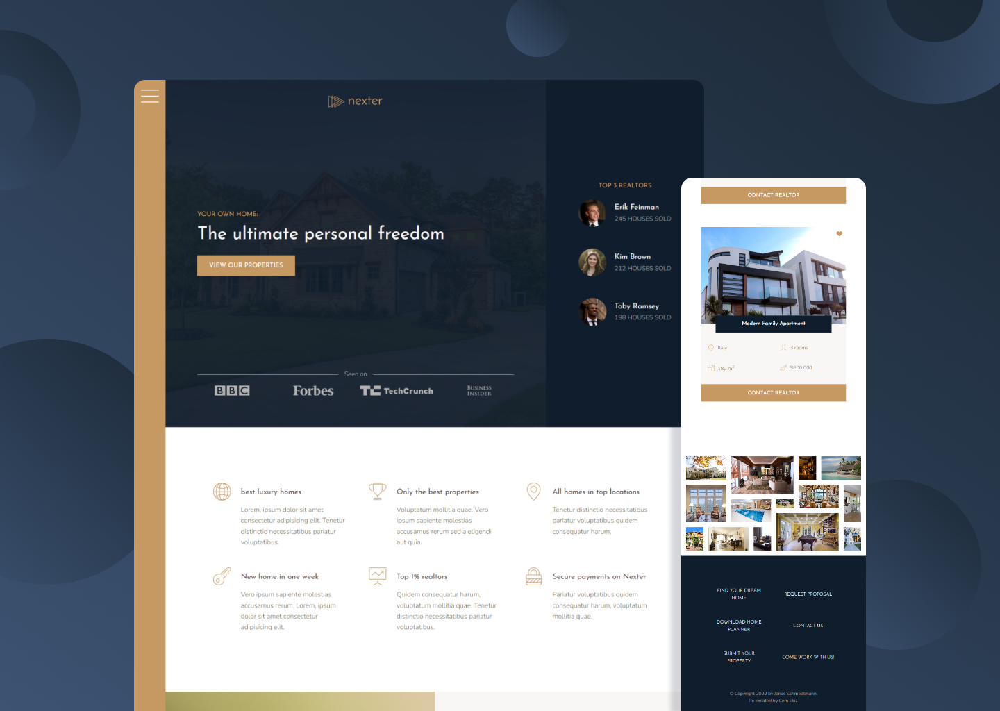

  

    <h1>Nexter</h1>
     
    
A modern and responsive website for a real estate agency specialized in luxury property

    <h3><a href="https://nexter-cem.netlify.app/">🔗 Link to the Website</a></h2>
    
  

## Built With

## Features

- Advanced CSS Grid Tricks
- Luxury and Professional Design
- Responsive Website

## Context of the project
This is a part of a Front-End Dev Course that i've completed on Udemy
